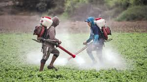
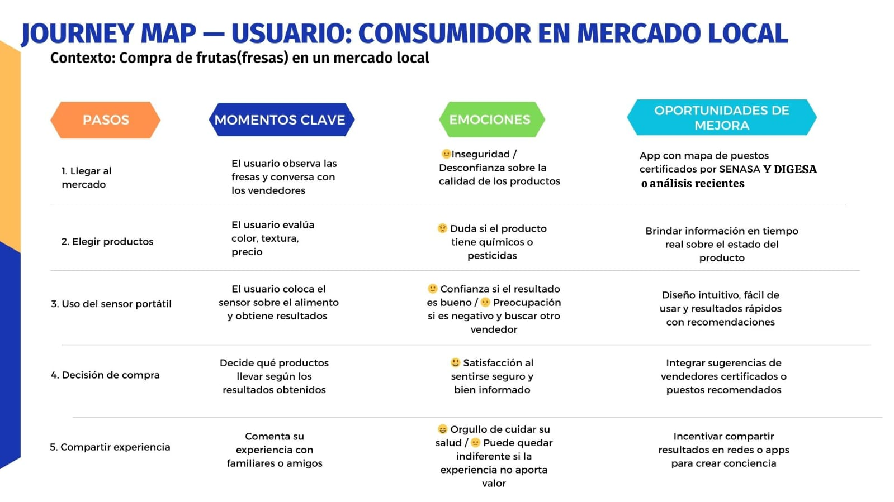

# 🚨 Problemática: Deterioro progresivo de la salud pública causado por la ingesta de fresas contaminadas con altos niveles de  pesticidas

La presencia de residuos de plaguicidas en fresas comercializadas en mercados locales representa una amenaza directa para la salud pública. El uso inadecuado de estos productos en la agricultura y la falta de trazabilidad permiten que las fresas lleguen contaminadas al consumidor final, sin una forma accesible de verificar su seguridad. Este riesgo se concentra en el último eslabón de la cadena de suministro, en el punto de compra. Los plaguicidas en las fresas pueden causar efectos crónicos en la salud, como enfermedades neurodegenerativas y daños hormonales, por lo que es urgente intervenir para reducir la exposición y proteger tanto la salud humana como promover un consumo más informado y seguro.

---
## 🏘️ Contexto Social

En el contexto social de Perú, la preocupación por la contaminación de productos agrícolas con pesticidas, metales pesados y micotoxinas es un tema de creciente relevancia, especialmente debido a su impacto en la salud pública. La agricultura en Perú es una de las principales actividades económicas, y muchos agricultores dependen del uso intensivo de químicos para maximizar la producción. Sin embargo, el uso indiscriminado de pesticidas y la exposición a suelos contaminados por actividades mineras o el riego con aguas no tratadas aumentan los riesgos de contaminación de los alimentos, lo que representa una amenaza para la salud de la población, en especial para las comunidades más vulnerables. La falta de conciencia y educación en prácticas agrícolas sostenibles, junto con la limitada capacidad de control de calidad y monitoreo en ciertas regiones, perpetúa estos riesgos. Este contexto social, en el que se enfrentan desafíos económicos, ambientales y de salud, destaca la urgente necesidad de implementar regulaciones más estrictas y mejorar la infraestructura agrícola en Perú para proteger tanto a los consumidores como a los productores de los efectos adversos de los contaminantes químicos.(2)

---

## 📊 Contexto Económico

### 🌍 A Nivel Mundial:
El uso de pesticidas es una práctica común en la agricultura moderna para proteger los cultivos y garantizar la seguridad alimentaria, sin embargo, esta práctica representa un riesgo significativo para la salud pública y el medio ambiente. Según la Organización Mundial de la Salud (OMS), se utilizan más de 1000 plaguicidas en el mundo, y estos productos son una de las principales causas de muerte por intoxicación, especialmente en países de ingresos medios y bajos. Ante esta situación la OMS apoya por prohibir los pesticidas más tóxicos y establecer límites máximos de residuos en alimentos y agua para proteger la salud pública (3).  
Por otro lado, la venta mundial de plaguicidas supera los 4 millones de toneladas anuales, lo que refleja la magnitud del problema y la necesidad de una regulación estricta y monitoreo constante. En consecuencia, la contaminación por pesticidas afecta la salud pública global, ya que contribuye el desarrollo a enfermedades crónicas y problemas de desarrollo cognitivo, especialmente en niños expuestos a organofosforados, que son altamente tóxicos (3).

### 🌎 A Nivel Regional (América Latina):
A nivel internacional, diversas investigaciones han evidenciado el alto costo económico asociado al uso intensivo de pesticidas. Por ejemplo, en el estado de Paraná, Brasil, se estima que por cada dólar invertido en pesticidas se generan aproximadamente 1,28 USD en costos externos, los cuales incluyen gastos en atención médica y pérdida de productividad por ausencias laborales. Este impacto económico negativo puede alcanzar los 149 millones de dólares anuales, según estudios publicados. En contraste, se ha demostrado que la adopción de prácticas de agricultura orgánica podría reducir estos costos hasta en 25 millones de dólares, destacando así la viabilidad económica de modelos agrícolas más sostenibles (4).  
Asimismo, en países fuera de América Latina también se han documentado problemáticas similares. Por ejemplo, un estudio realizado en Egipto reveló que el 27 % de las fresas y tomates analizados presentaban residuos de pesticidas por encima de los límites máximos tolerables establecidos por normativas internacionales, lo que representa un riesgo directo para la salud de los consumidores y un obstáculo para el comercio internacional de productos agrícolas (5).

### 🇵🇪 A Nivel Nacional (Perú):
En Perú, el uso de pesticidas organofosforados en productos agrícolas, como las fresas, representa un problema de salud pública creciente. A pesar de la prohibición del clorpirifos en 2024, su uso continúa debido a deficiencia en el control y fiscalización. Como resultado, se observan efectos negativos en la salud, especialmente en grupos vulnerables, con consecuencias como trastornos endocrinos y alteraciones en el desarrollo infantil.  
En el plano socioeconómico, muchos productores, como los de fresas en Cañete (Lima), enfrentan dificultades para acceder a información adecuada sobre el uso seguro de plaguicidas, lo que agrava la contaminación, disminuye la productividad y repercute negativamente en sus ingresos y calidad de vida (6).  
Tomando como referencia el caso de Brasil, donde cada dólar invertido en pesticidas genera USD 1.28 en costos externos por salud y ausentismo laboral (7), y considerando que en Perú se destinan unos USD 3 millones anuales a pesticidas para fresas, se puede inferir que los costos indirectos en salud pública podrían superar los USD 3.84 millones anuales.  
En consecuencia, la agricultura peruana enfrenta el desafío de equilibrar la necesidad de aumentar la producción y exportación con la adopción de prácticas sostenibles y una mejor gestión de contaminantes químicos, a fin de proteger tanto la salud de los consumidores como la viabilidad económica del sector (8).

---

En este contexto, nos centraremos en la fresa como el principal alimento para nuestro proyecto de detección de químicos en alimentos. Este producto, debido a su alta prevalencia de residuos de plaguicidas, es fundamental para abordar los riesgos asociados con la seguridad alimentaria, especialmente en la última parte de la cadena de producción, en el punto de venta donde las personas acceden al producto. Esto permitirá a los consumidores tomar decisiones más informadas sobre los alimentos que eligen consumir, asegurando una mayor seguridad alimentaria.

## Muestras  

---
## Journey Map  

# Referencias:
Delgado Zegarra J. Fresas altas en pesticidas se venden en 5 mercados de Lima y Callao. Salud con lupa. 2024 nov 21. Disponible en: https://saludconlupa.com/opinion/fresas-pesticidas-mercados-lima-callao/

Actualidad Ambiental. (2024, 27 de noviembre). Alertan que fresas altas en pesticidas se venden en 5 mercados de Lima y Callao. https://www.actualidadambiental.pe/alertan-que-fresas-altas-en-pesticidas-se-venden-en-5-mercados-de-lima-y-callao/ 

---
## Mapa de empatía  

# Referencias:
Samoli E, Stafoggia M, Rodopoulou S, Ostro B, Alessandrini E, Basagaña X, et al. Which specific causes of death are associated with short term exposure to fine and coarse particles in Southern Europe? Results from the MED-PARTICLES project. Environ Int. 2014 ;67:54–61. Disponible en: https://doi.org/10.1016/j.envint.2014.02.013

Organización de las Naciones Unidas para la Alimentación y la Agricultura (FAO). El estado mundial de la agricultura y la alimentación 2019: Progresos en la lucha contra la pérdida y el desperdicio de alimentos. Roma: FAO; 2019 . Disponible en: https://openknowledge.fao.org/server/api/core/bitstreams/2120f787-5a49-41f5-a9fb-f4ceaac98b2c/content

Krieger RI. Riesgos a la salud por pesticidas en los alimentos. Seattle (WA): Center for Ecogenetics & Environmental Health – Universidad de Washington; 2008  Disponible en: https://depts.washington.edu/ceeh/downloads/FF_Pesticides_SP.pdf

---
## Mapa de ISHIKAWA 

# Referencias:
Guerrero J. Estudio de residuos de plaguicidas en frutas y hortalizas en áreas específicas de Colombia [Internet]. Bogotá: Universidad Nacional de Colombia, Facultad de Agronomía, Centro Editorial; 2003. Disponible en: https://repositorio.unal.edu.co/handle/unal/33001

Benítez-Díaz P, Miranda-Contreras L, Balza-Quintero A, Sánchez-Gil B, Molina-Morales Y. Residuos de plaguicidas en fresa (Fragraria x ananassa) cosechada en una región agrícola del estado Mérida, Venezuela: SciELO Venezuela;. Disponible en: https://ve.scielo.org/scielo.php?script=sci_arttext&pid=S1316-33612015000300007

---

## ✅ Propuesta de Solución

### 🧠 Introducción
En respuesta al problema de la exposición no controlada a residuos de pesticidas en alimentos, especialmente en fresas comercializadas en mercados locales, proponemos el desarrollo de un **sistema portátil y económico** que permita detectar de forma no invasiva la presencia de **compuestos orgánicos volátiles (VOCs)** asociados a **pesticidas organofosforados**. Este sistema se apoya en tecnologías accesibles como sensores espectrales, microcontroladores y componentes electrónicos de bajo costo, siendo una solución concreta y alineada con el **ODS 12 - Producción y Consumo Responsables**.

### 🎯 Objetivo Específico
Desarrollar un prototipo funcional basado en Arduino que identifique niveles de VOCs relacionados con residuos de pesticidas en fresas, clasificando el riesgo y mostrándolo de forma clara y comprensible al usuario final mediante una pantalla LED.

---
## 📚 Referencias 

1. Naciones Unidas. Consumo y producción sostenibles [Internet]. Nueva York: Naciones Unidas; [fecha desconocida] [citado 2025 may 6].
    Disponible en: https://www.un.org/sustainabledevelopment/es/sustainable-consumption-production/
2. Galagarza OA, Ramirez-Hernandez A, Oliver HF, Álvarez Rodríguez MV, Valdez Ortiz MDC, Pachari Vera E, et al. Occurrence of chemical contaminants in Peruvian produce: A food-safety perspective. Foods [Internet].   
   2021;10(7):1461. Disponible en: http://dx.doi.org/10.3390/foods10071461
3. World Health Organization: WHO. Pesticide residues in food [Internet]. 2022. Available from: https://www.who.int/news-room/fact-sheets/detail/pesticide-residues-in-food
   
4. Soares WL, De Souza Porto MF. Uso de agrotóxicos e impactos econômicos sobre a saúde. Revista De Saúde Pública [Internet]. 2012 Mar 17;46(2):209–17. Available from: https://pubmed.ncbi.nlm.nih.gov/22310653/
   
5. Leskovac A, Petrović S. Pesticide Use and Degradation Strategies: Food safety, challenges and perspectives. Foods [Internet]. 2023 Jul 15;12(14):2709. Available from: https://www.mdpi.com/2304-8158/12/14/2709
   
6. Arteaga AAB, Quispe PR, González RDC, Coronado GJ. Factores socioeconómicos, productivos y fuentes de información sobre plaguicidas para productores de Fragaria x ananassa en Cañete, Lima, Perú. Idesia [Internet]. 2017 Jan 1;(ahead):1–7. Available from: https://www.scielo.cl/scielo.php?pid=S0718-34292017005000008&script=sci_arttext
    
7. López-Benítez A, Guevara-Lara A, Domínguez-Crespo MA, Andraca-Adame JA, Torres-Huerta AM. Concentrations of organochlorine, organophosphorus, and pyrethroid pesticides in rivers worldwide (2014–2024): A review. Sustainability [Internet]. 2024 Sep 15;16(18):8066. Available from: https://www.mdpi.com/2071-1050/16/18/8066
    
8. Galagarza OA, Ramirez-Hernandez A, Oliver HF, Rodríguez MVÁ, Del Carmen Valdez Ortiz M, Vera EP, et al. Occurrence of chemical contaminants in Peruvian produce: A Food-Safety perspective. Foods [Internet]. 2021 Jun 24;10(7):1461. Available from: https://www.mdpi.com/2304-8158/10/7/1461

   

