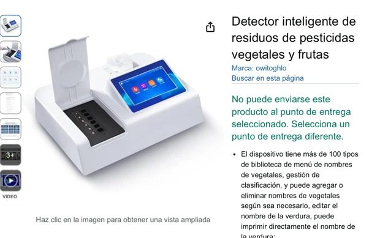

**ARTÍCULO CIENTÍFICO:**  
Este estudio presenta un biosensor electroquímico integrado en un guante diseñado para cuantificar pesticidas organofosforados directamente en la superficie de frutas. El biosensor utiliza una sonda biohíbrida que combina azul de Prusia, negro de carbono y la enzima butirilcolinesterasa. El principio de detección se basa en la inhibición de la actividad enzimática en presencia del pesticida, específicamente el diclorvós.

El sistema fue probado directamente en cáscaras de frutas como manzanas y naranjas, donde el usuario simplemente debía frotar la superficie de la fruta con la tira del guante y realizar una lectura electroquímica. El sistema portátil mostró un límite de detección bajo en el rango nanomolar (altamente sensible) y una repetibilidad satisfactoria de menos del 10 %. Este avance representa un punto de partida hacia el desarrollo de biosensores portátiles aplicables en diversos campos, incluida la agricultura de precisión.

🔗 [https://doi.org/10.1016/j.talanta.2024.127093](https://doi.org/10.1016/j.talanta.2024.127093)

**🔗 PRODUCTO COMERCIAL:**  
[Detector inteligente de residuos de pesticidas - Amazon](https://www.amazon.com/-/es/Detector-inteligente-residuos-pesticidas-vegetales/dp/B0C559RHBQ)

## 📄 PATENTE

La invención presenta un **sensor electroquímico para la detección de pesticidas organofosforados** y un método para su preparación, perteneciente al campo técnico de la detección de residuos de pesticidas. El sensor se fabrica mediante la **modificación secuencial de un material compuesto de MXene-CNTs (nanotubos de carbono)** y **nanopartículas de oro o platino** sobre la superficie de un electrodo de carbono vítreo.

El material **MXene-CNTs** combina nanotubos de carbono entre las capas y en la superficie de hojas de nanos MXene, mientras que las **nanopartículas de oro/plata** se distribuyen sobre la superficie de este material.

El sensor permite la detección de pesticidas organofosforados con **alta sensibilidad**. Además, el método es **simple, rápido, de bajo costo** y **no requiere pretratamientos complejos**, lo cual lo convierte en una herramienta eficaz y conveniente para el análisis de residuos.

🔗 [ patente de Google Patents (CN113390943A)](https://patents.google.com/patent/CN113390943A/en)

