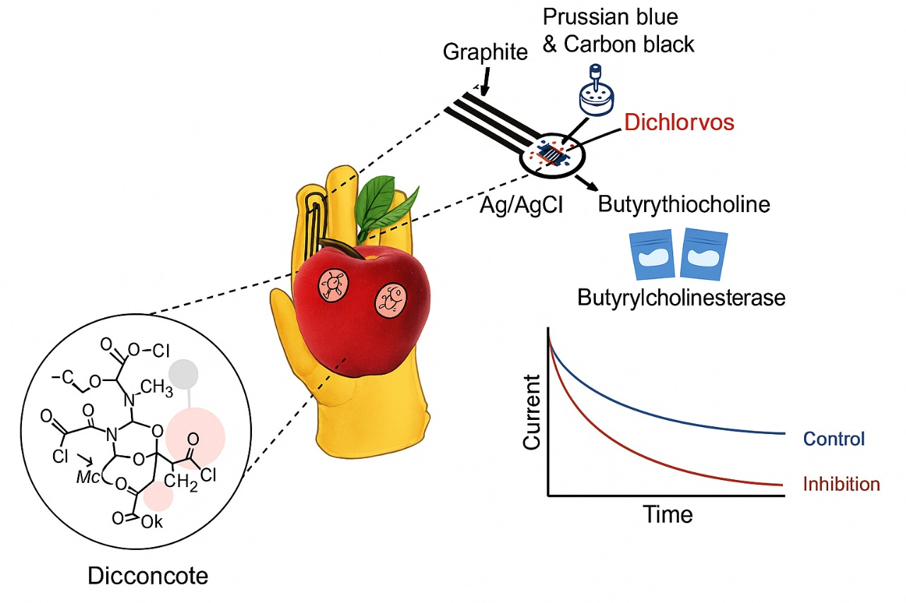
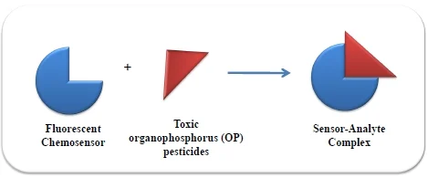
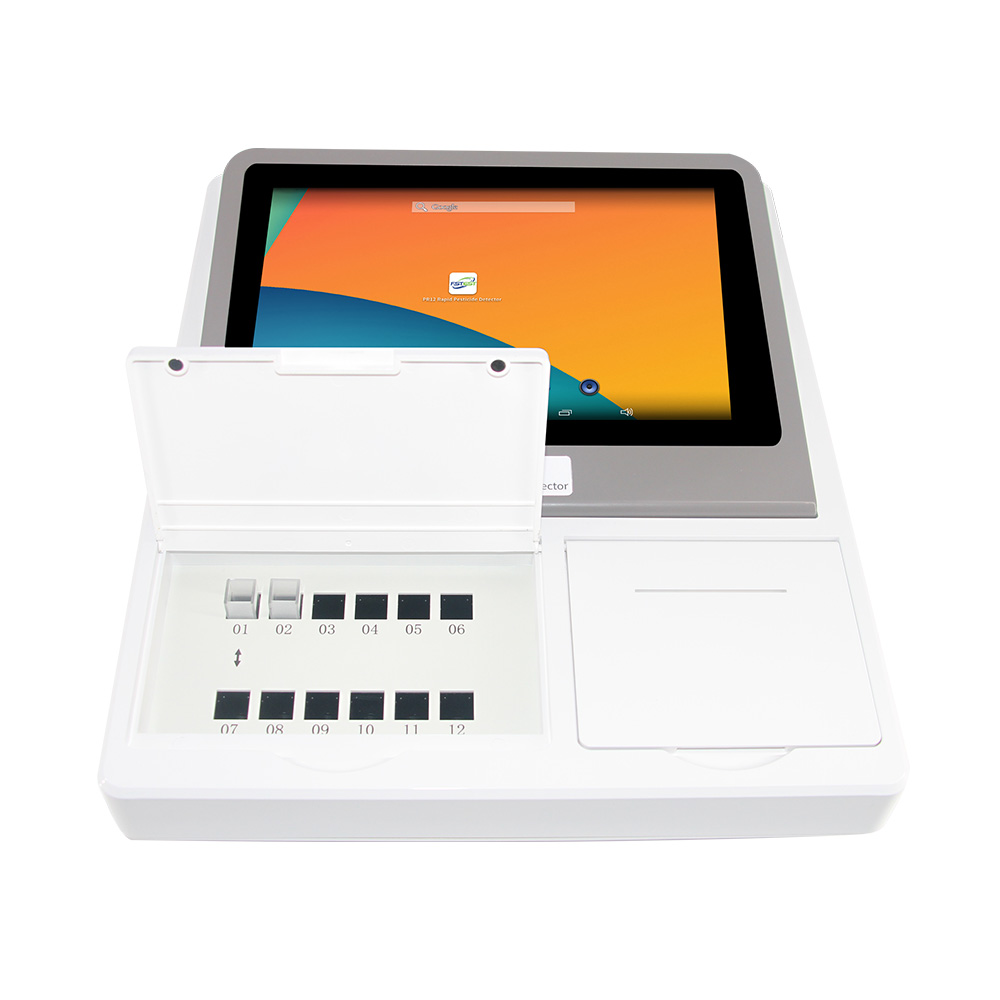
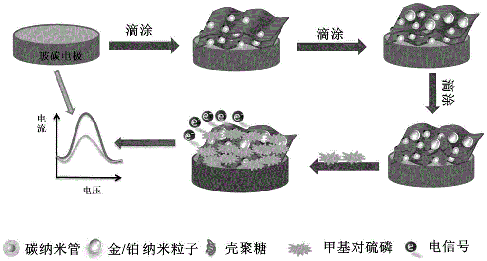
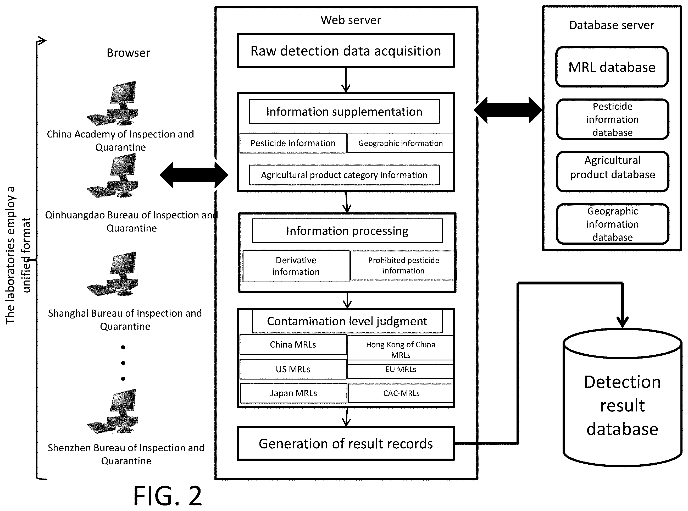

# 📌ARTÍCULOS CIENTÍFICOS:  

## Artículo 1
## Biosensor electroquímico portátil integrado en guante para detección de pesticidas en frutas
Este estudio presenta un biosensor electroquímico integrado en un guante diseñado para cuantificar pesticidas organofosforados directamente en la superficie de frutas. El biosensor utiliza una sonda biohíbrida que combina azul de Prusia, negro de carbono y la enzima butirilcolinesterasa. El principio de detección se basa en la inhibición de la actividad enzimática en presencia del pesticida, específicamente el diclorvós.

El sistema fue probado directamente en cáscaras de frutas como manzanas y naranjas, donde el usuario simplemente debía frotar la superficie de la fruta con la tira del guante y realizar una lectura electroquímica. El sistema portátil mostró un límite de detección bajo en el rango nanomolar (altamente sensible) y una repetibilidad satisfactoria de menos del 10 %. Este avance representa un punto de partida hacia el desarrollo de biosensores portátiles aplicables en diversos campos, incluida la agricultura de precisión.

  

**Autores**: Antonella Miglione, Ada Raucci, Marco Mancini, Valentina Gioia, Alessandro Frugis, Stefano Cinti  
*Talanta 283 (2025) 127093. https://doi.org/10.1016/j.talanta.2024.127093*  

## Artículo 2

## Fluorescent Chemosensors for Toxic Organophosphorus Pesticides

Este artículo revisa los avances recientes en el desarrollo de quimiosensores fluorescentes para detectar pesticidas organofosforados (OP) tóxicos y compuestos relacionados. Los OP son ampliamente utilizados en la agricultura debido a su eficacia como insecticidas, pero su alta toxicidad y persistencia en el medio ambiente representan riesgos significativos para la salud humana y la vida silvestre. Los métodos tradicionales de detección, como la cromatografía y la espectrometría de masas, son costosos y requieren mucho tiempo. Como alternativa, los quimiosensores fluorescentes ofrecen ventajas como alta sensibilidad, respuesta rápida y la capacidad de detectar OP en bajas concentraciones. El artículo discute el diseño de sensores con modos duales de transducción de señales (ópticos y electroquímicos) para minimizar falsos positivos y mejorar la selectividad. También se destacan los desafíos futuros, como la necesidad de sensores robustos para matrices complejas, como sistemas acuosos.

**Obare, S.O.; De, C.; Guo, W.; Haywood, T.L.; Samuels, T.A.; Adams, C.P.; Masika, N.O.; Murray, D.H.; Anderson, G.A.; Campbell, K.; Fletcher, K.**  
*Sensors 2010, 10, 7018-7043. https://doi.org/10.3390/s100707018*

# 🔗 PRODUCTO COMERCIAL:
## 1. CideLite – Charm Sciences
Ensayo enzimático bioluminiscente para la detección de pesticidas organofosforados y carbamatos en alimentos. Alta sensibilidad y resultados en 15 minutos.  

 [Charm Sciences](https://www.charm.com/products/test-and-kits/pesticide-tests/cidelite/)

## 2. PR12 Rapid Pesticide Detector – FSTest
Detector portátil basado en espectrofotometría, detecta organofosforados y carbamatos. Resultados en 3 minutos, pantalla táctil y conectividad Wi-Fi. 

[FSTest](https://www.fstestcorp.com/products-detail/id-59.html)

# 📄 PATENTES

## 1. Sensor electroquímico para la detección de pesticidas organofosforados y método de preparación del mismo

- **Número de Publicación:** CN113390943A  
- **Fecha de Publicación:** 14/09/2021  
- **Autores:** Hou Xiudan, Ding Rong, Yang Qingli, Yu Hui, Yu Chundi, Tang Juan  
- **Institución:** Universidad Agrícola de Qingdao (青岛农业大学)  

Este sensor electroquímico ha sido diseñado para la detección rápida y sensible de residuos de pesticidas organofosforados. Se construye mediante la modificación secuencial de un electrodo de carbono vítreo con un material compuesto de MXene-CNTs (una combinación de nanoláminas de MXene y nanotubos de carbono) y nanopartículas de oro y platino. Esta estructura proporciona alta conductividad y gran área superficial, lo que amplifica la señal electroquímica.  

Es especialmente sensible a pesticidas con grupos nitro en anillos bencénicos. El método de detección es simple, rápido, de bajo costo, no requiere pretratamiento complejo y permite la cuantificación de residuos en frutas, verduras u otros alimentos mediante voltametría cíclica.

  

🔗 [Google Patents – CN113390943A](https://patents.google.com/patent/CN113390943A)

---

## 2. Plataforma de detección de residuos de pesticidas basada en espectrometría de masas de alta resolución, Internet y ciencia de datos, y método para generar automáticamente informes de detección

- **Número de Publicación:** US11256723B2  
- **Fecha de Publicación:** 22/02/2022  
- **Autores:** Guofang Pang, Yi Chen, Chunlin Fan, Xiaobo Zou, Yuehong Sun, Qiaoying Chang, Kun Hou, Bing Fang, Ruobin Bai  
 
Este sistema permite la detección y análisis automatizado de residuos de pesticidas en productos agrícolas como frutas y verduras. Se basa en una plataforma tecnológica que integra:
- Espectrometría de masas de alta resolución  
- Internet  
- Ciencia de datos  
El sistema analiza automáticamente los resultados, genera tablas, gráficos e informes completos que pueden descargarse con un solo clic, optimizando la gestión de la seguridad alimentaria y el control de residuos en el sector agrícola.

  

🔗 [Google Patents – US11256723B2](https://patents.google.com/patent/US11256723B2)

# Referencias Bibliograficas 
An electrochemical biosensor for on-glove application: Organophosphorus pesticide detection directly on fruit peels. https://www.sciencedirect.com/science/article/pii/S0039914024014723?via%3Dihub 

Fluorescent Chemosensors for Toxic Organophosphorus Pesticides: A Review https://www.mdpi.com/1424-8220/10/7/7018

Charm Sciences. (s.f.). CideLite Pesticide Test. https://www.charm.com/products/test-and-kits/pesticide-tests/cidelite/

FSTest Corporation. (s.f.). PR12 Rapid Pesticide Detector.  https://www.fstestcorp.com/products-detail/id-59.html

