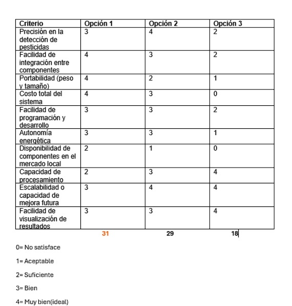

# 🧩 Matriz Morfológica

---
# 📊 Tabla de Valores

# 📌 Conclusión
La opción 1 representa la alternativa más equilibrada para el desarrollo del prototipo, al ofrecer una combinación adecuada entre funcionalidad, costo y facilidad de implementación. Si bien no alcanza los niveles más altos de precisión o procesamiento como otras opciones, destaca por su bajo costo total (S/150.5), alta portabilidad, buena integración entre componentes y una programación accesible mediante Arduino UNO. Estos factores la convierten en la opción más viable para la etapa de prototipado, especialmente considerando la disponibilidad de componentes y la facilidad de desarrollo. En conjunto, esta opción garantiza un rendimiento sólido sin comprometer el presupuesto, cumpliendo así con los objetivos del proyecto en términos de eficiencia y accesibilidad.

