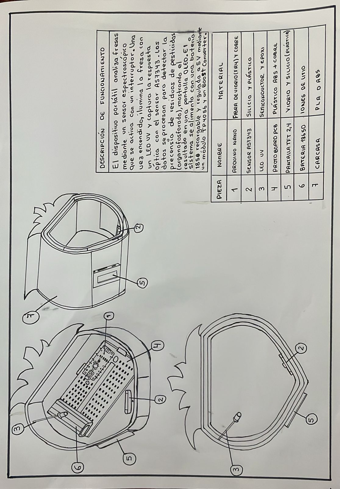
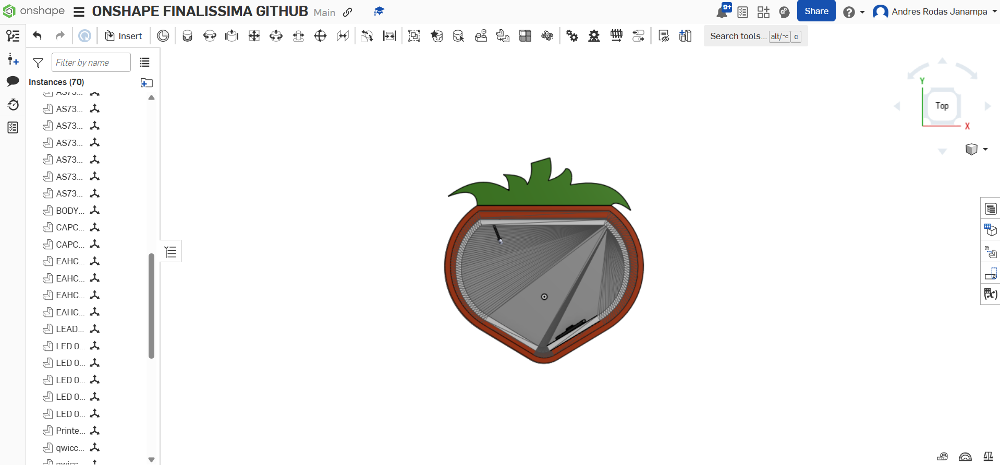
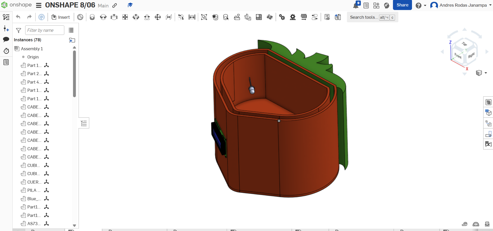
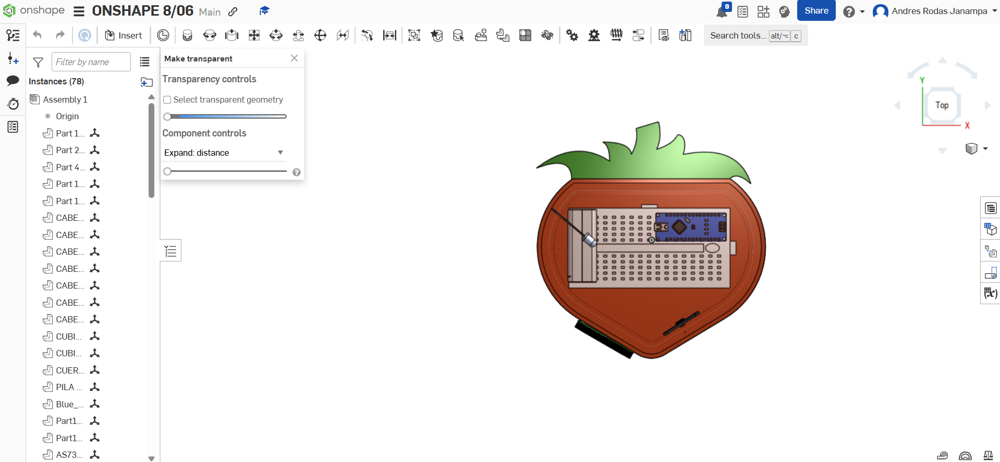
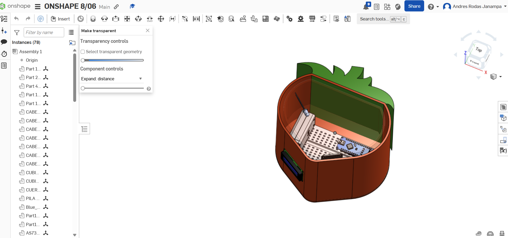

# ✏️ Prototipado y Bocetos

## 🧩 Bocetos Iniciales – Ideas Propuestas

Durante la etapa de diseño, se exploraron **tres ideas distintas** para el desarrollo del proyecto. Cada una fue representada mediante un boceto, con el objetivo de analizar visualmente sus ventajas y desventajas antes de elegir la más adecuada para el prototipado final.

---

### 💡 Boceto 1 – Idea Seleccionada

Este primer boceto fue el que finalmente se eligió para desarrollar el prototipo 3D. Se valoró su simplicidad, funcionalidad y facilidad de ensamblaje.

---

### 💡 Boceto 2 – Alternativa con diseño modular

En esta propuesta se exploró un diseño más modular, con componentes intercambiables. Sin embargo, se descartó por su mayor complejidad de fabricación.

---

### 💡 Boceto 3 – Diseño con movilidad

Esta idea incluía elementos móviles y articulaciones. Aunque innovadora, se consideró menos estable para los fines del proyecto.

---

## 🛠️ Prototipo 3D Final – Modelado en Onshape

El **Boceto 1** fue la base para crear el modelo final en **Onshape**, una herramienta CAD colaborativa. Esto nos permitió visualizar en 3D el diseño definitivo y validar las dimensiones y la estructura general.

🔗 **Enlace al prototipo en Onshape:**  
👉 [Ver modelo en Onshape]([https://cad.onshape.com/documents/62a71347bcf43b206f2fa3ce/w/6952c6cc66f60fffa0542bf9/e/4242771c9497698b770d1021?renderMode=0&uiState=6846796fad6c5357d42d262d](https://cad.onshape.com/documents/1f60ffb5e8126be7b4a6f263/w/7c7647805152f92d44befed0/e/2cf5b0b9592ee5f201c2ad6a?renderMode=0&uiState=6852412c591bc3701dedb185))

> ⚠️ Nota: Asegúrate de tener acceso con tu cuenta en Onshape para visualizar el diseño.

### 🖼️ Vistas del modelo 3D

#### 🔷 Con tapa
1. **Vista Superior (Top)**

2. **Vista Frontal + Superior**

#### 🔶 Sin tapa
3. **Vista Superior (Top)**

4. **Vista Frontal + Superior**

---

## ✅ Conclusiones

- La exploración de varias ideas fue clave para tomar una mejor decisión
- El prototipo final mantiene un equilibrio entre funcionalidad y simplicidad
- Onshape permitió validar visualmente el diseño antes de su construcción
- Las 4 vistas del modelo (con/sin tapa) confirman la correcta integración de componentes

