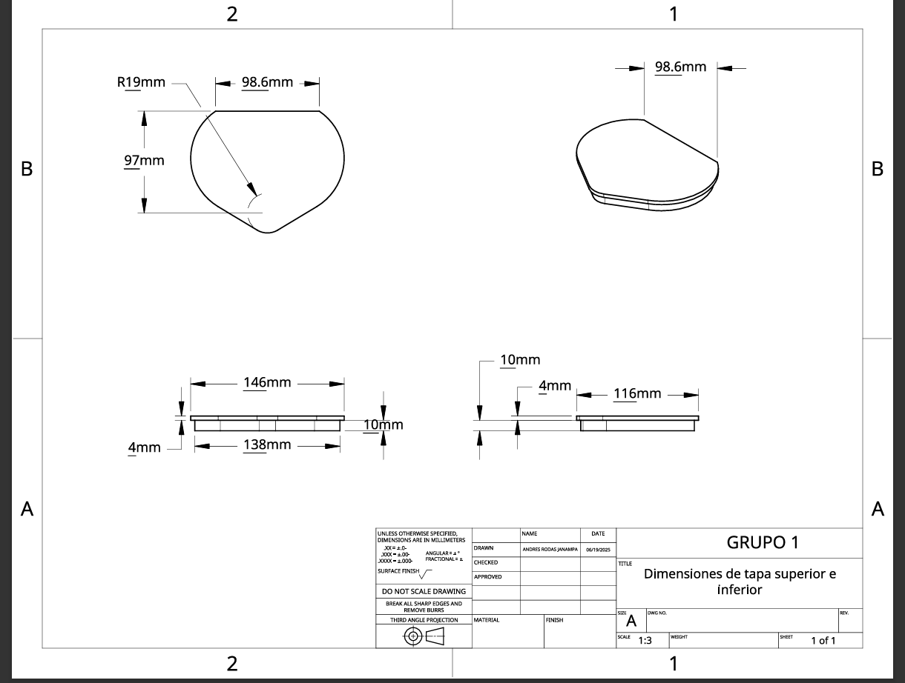
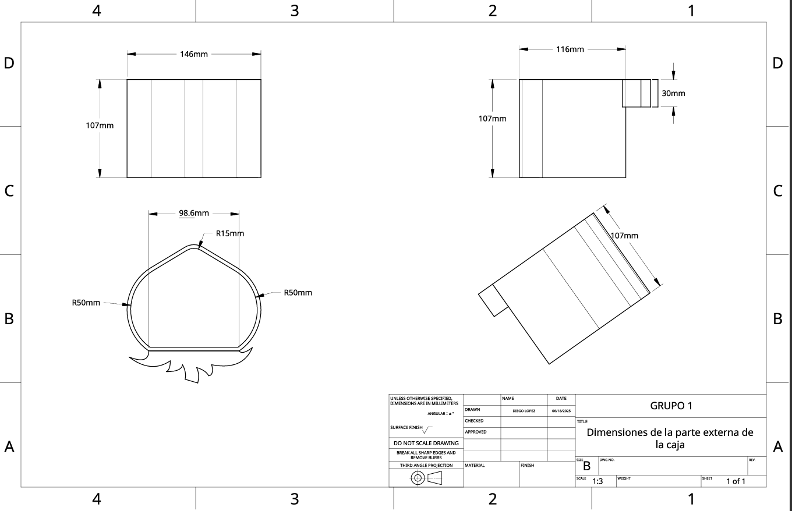
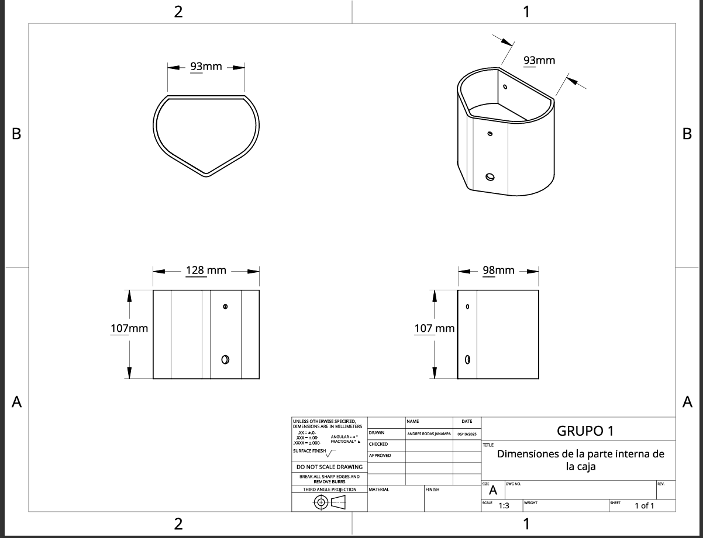
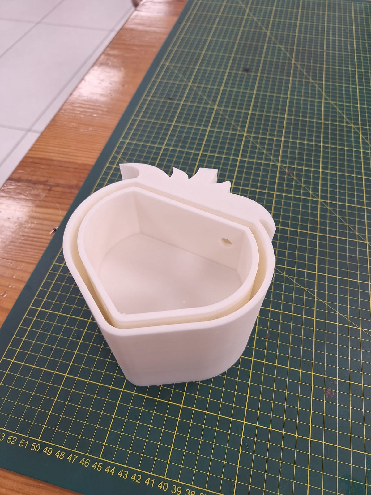
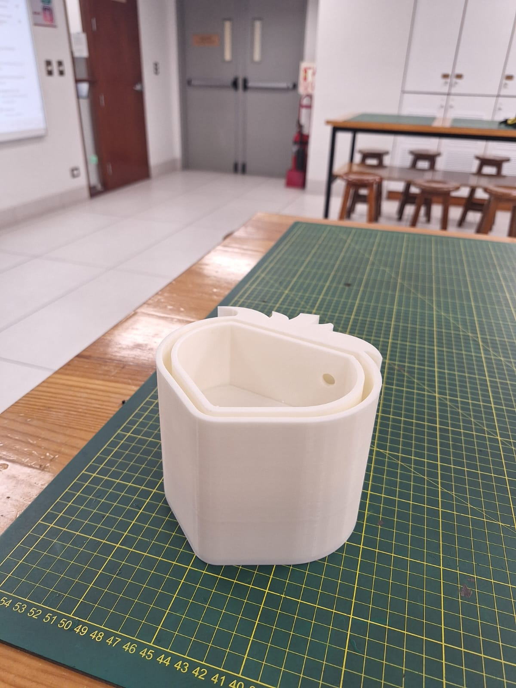
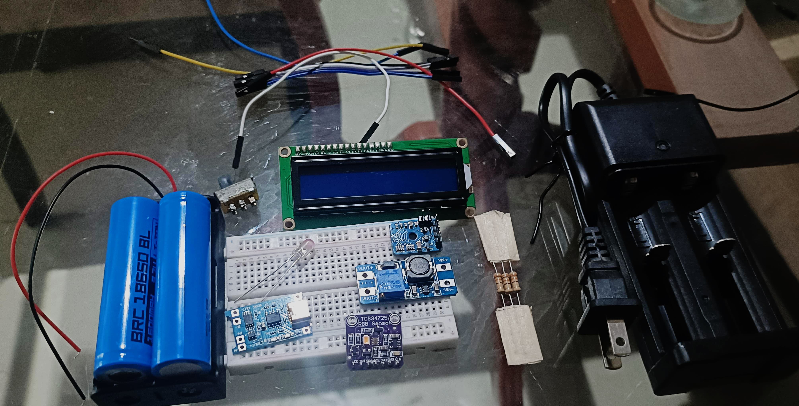

## 📐 Planos de impresión 3D

A continuación se presentan los planos técnicos generados desde Onshape para cada una de las piezas del modelo impreso:

### 🔹 Tapa

### 🔹 Parte externa

### 🔹 Parte interna

---

## ⚖️ Cuadro de pesos por componente

| Componente     | Peso (g) |
|----------------|----------|
| Parte interna  | 140 g    |
| Parte externa  | 161 g    |
| Tapa 1         | 53 g     |
| Tapa 2         | 53 g     |
| **Total**      | **407 g** |

---

## 🖨️ Fotos del modelo impreso final

A continuación, se muestran imágenes del prototipo impreso utilizando material **PLA**:

  
  

## 🧩 Componentes por separado

