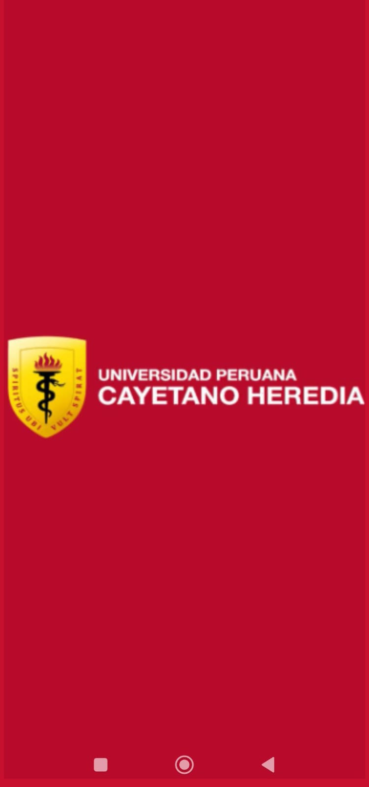
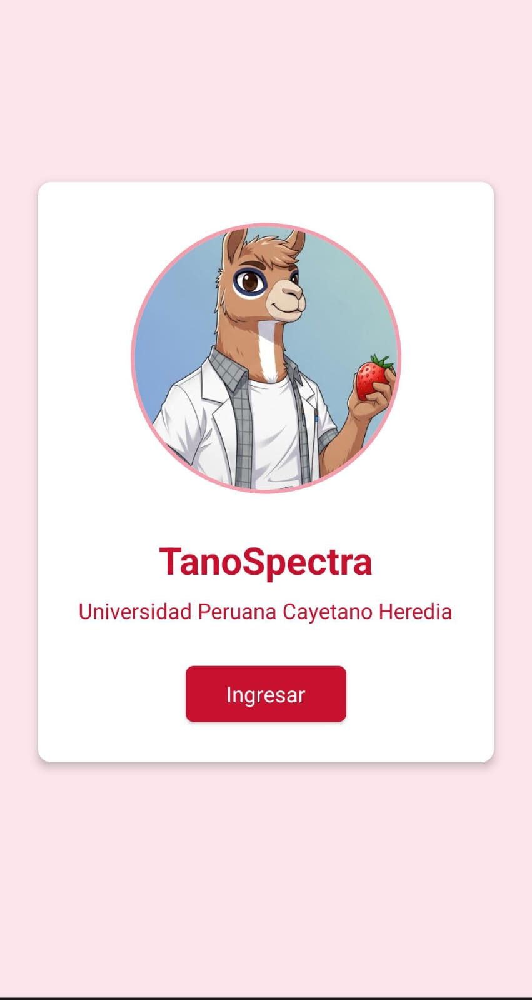
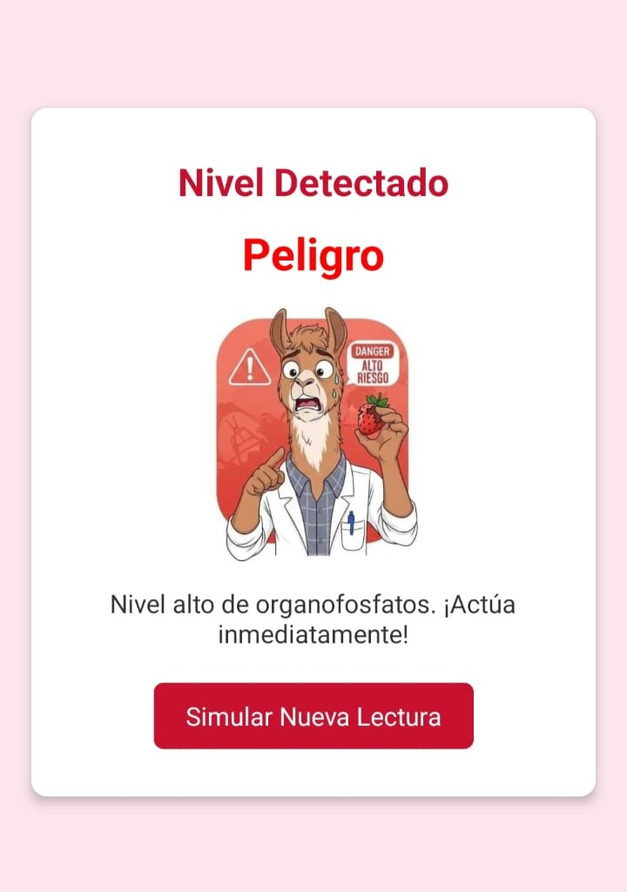
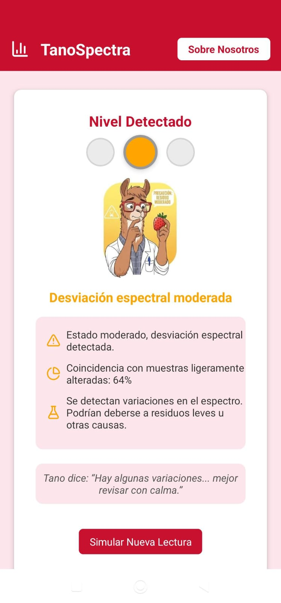
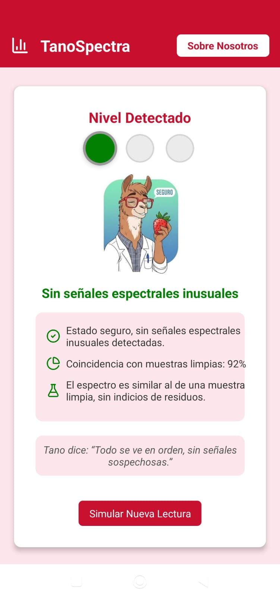
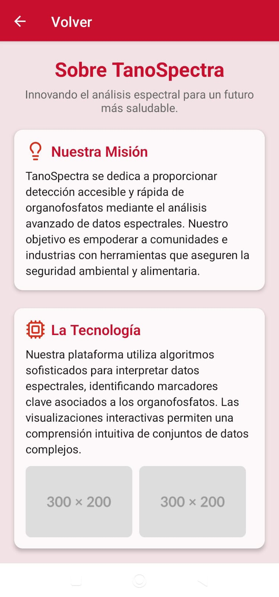
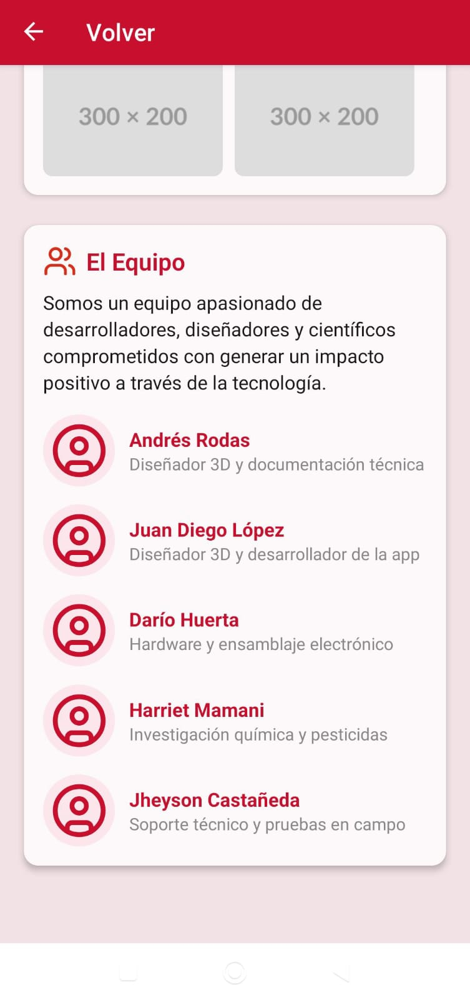

# Detalles del Software del Aplicativo

Este documento forma parte del desarrollo del aplicativo **TanoSpectra**, detallando el software implementado, su estructura, tecnologías empleadas y cómo se integra dentro del sistema completo.

## 📁 Repositorio del proyecto

Todo el código fuente y documentación del proyecto se encuentra disponible en el siguiente repositorio de GitHub:

🔗 [https://github.com/die-go12/TanoSpectra-app.git](https://github.com/die-go12/TanoSpectra-app.git)

## 📄 Contenido del documento

Este archivo incluye:

- Descripción general del software del aplicativo.
- Arquitectura del sistema y diagrama de componentes.
- Tecnologías, frameworks y lenguajes utilizados.
- Descripción de los principales módulos o microservicios.
- Detalles sobre el flujo de datos y comunicación entre componentes.
- Consideraciones sobre la escalabilidad, mantenimiento y seguridad.
- Capturas de pantalla o ejemplos de interfaz.

## ⚙️ Tecnologías empleadas

| Categoría             | Tecnología                                       |
|-----------------------|--------------------------------------------------|
| Framework principal   | React Native (con Expo)                          |
| Lenguaje              | TypeScript, JavaScript                           |
| Navegación            | React Navigation + expo-router                   |
| Empaquetador          | Metro (a través de Expo)                         |
| Entorno de desarrollo | Expo                                             |
| Control de versiones  | Git + GitHub                                     |


## 📌 Instrucciones generales

Para clonar el repositorio y comenzar a trabajar con el software:

```bash
git clone https://github.com/die-go12/TanoSpectra-app.git
cd TanoSpectra-app

```

# 📱 Interfaz de Usuario - TanoEspectra

La siguiente galería muestra el flujo visual de la aplicación **TanoEspectra**, desarrollada para facilitar la detección rápida de residuos de pesticidas en frutas y verduras.

---

## 🏁 Pantalla de Inicio

Al iniciar la aplicación, se muestra una pantalla de bienvenida con el logo de nuestra universidad **Cayetano Heredia**, sobre un fondo rojo institucional.



---

## 🔓 Pantalla de Ingreso

Posteriormente, aparece la pantalla con un botón para ingresar a la aplicación y el nombre de la app: **TanoEspectra**.



---

## 📡 Solicitar Lectura

Una vez dentro, el usuario puede solicitar una lectura de pesticidas mediante el botón principal que activa el sensor espectral.


---

## 🟥 Nivel Peligroso

> Alta concentración de organofosforados detectada.  
> **No se recomienda el consumo.**



---

## 🟧 Nivel de Advertencia

> Se detectaron rastros moderados.  
> **Lavar bien el producto antes de consumir.**



---

## 🟩 Nivel Seguro

> No se detectaron niveles preocupantes.  
> **Apto para el consumo.**



---

## ℹ️ Sobre TanoEspectra

Nuestra app **TanoEspectra** nace con el objetivo de empoderar a consumidores y vendedores con una herramienta práctica para el análisis de residuos en productos frescos.



---

## 👥 Sobre Nosotros

Somos un equipo multidisciplinario comprometido con el desarrollo tecnológico aplicado a la seguridad alimentaria.




