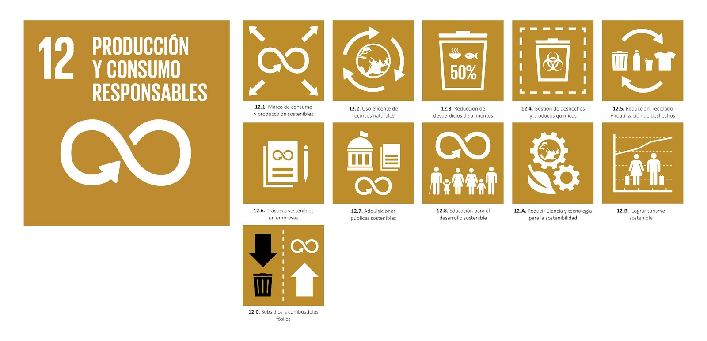

# 🍓 Proyecto ODS 12 - Detección de Organofosforados en Fresas

Este repositorio documenta el desarrollo de un sensor portátil para la detección de pesticidas organofosforados en fresas, una herramienta diseñada para proteger la salud del consumidor y el medio ambiente.

 El proyecto se alinea con el Objetivo de Desarrollo Sostenible (ODS) 12: Producción y Consumo Responsables, y específicamente con la meta 12.4, cual busca reducir los impactos negativos de sustancias químicas peligrosas a lo largo de su ciclo de vida.
>
Fuente: Almagra, 2019

 Nuestro sensor portátil aporta a esta meta al detectar pesticidas en fresas, ayudando a prevenir daños invisibles en las personas.

---

## 🏆 Objetivo del Proyecto

Diseñar y construir un **sensor portátil y económico** que permita identificar la presencia de **organofosforados volátiles** en fresas, utilizando sensores espectrales y tecnología de microcontroladores.  
El sistema permitirá monitorear la calidad de frutas provenientes de mercados locales, reduciendo el riesgo de exposición a sustancias dañinas para la salud humana.

---

## 👥 Equipo de Trabajo

- **Andrés Rodas**: Coordinador de diseño y modelado 3D del sensor portátil  
- **Juan Diego López**: Coordinador de desarrollo y programación del sistema de detección  
- **Darío Huerta**: Coordinador de gestión y documentación del proyecto  
- **Harriet Mamani**: Coordinadora de investigación química y análisis de pesticidas  
- **Jheyson Castañeda**: Soporte técnico y validación de pruebas en campo  

---

## 🌍 Impacto Esperado

- 🧬 **Reducción de la exposición a pesticidas organofosforados**, especialmente en comunidades vulnerables.
- 🍓 **Control de calidad accesible** para productos agrícolas vendidos en mercados locales.
- 📢 **Empoderamiento del consumidor** mediante tecnología portátil e información en tiempo real.
- 📈 **Apoyo a la fiscalización** de alimentos contaminados y promoción de prácticas agrícolas sostenibles.

---

---
## 🤝 ¿Cómo colaborar?

Estamos abiertos a contribuciones técnicas, ideas para optimizar el sensor, propuestas de interfaz o incluso mejoras en el análisis químico.  
Si deseas colaborar o compartir conocimientos relacionados, ¡bienvenido/a!

---

## 🎓 Proyecto académico

Este repositorio fue desarrollado para el curso **Fundamentos de Diseño - 2025**  
**Universidad Peruana Cayetano Heredia (UPCH)**  
Facultad de Ingeniería – Carrera de Ingeniería Informática

---
## Bibliografía 
Anónimo. (2019). Metas y Objetivos de la Agenda 2030: ODS12 Producción y Consumo Responsables. Almagra Cultura y Naturaleza http://almagraculturaynaturaleza.blogspot.com/2019/03/metas-y-objetivos-de-la-agenda-2030_43.html 

